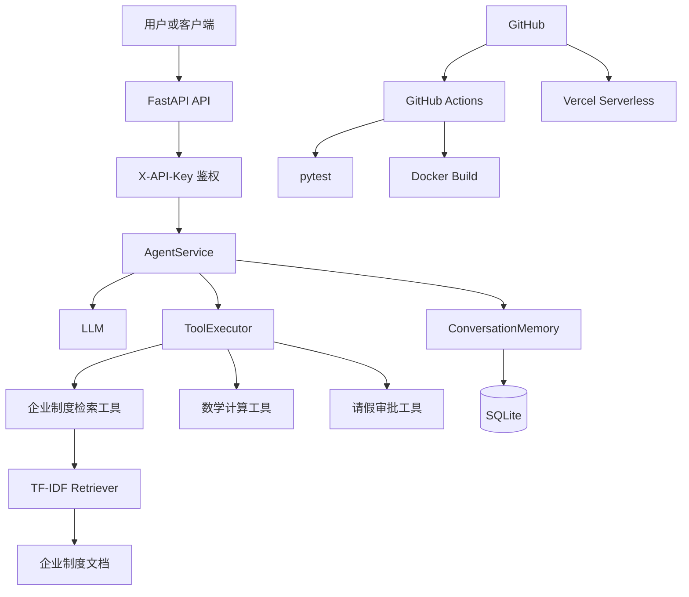

# Enterprise Agent

[](https://github.com/jy111Y/enterprise-agent/actions/workflows/ci.yml)

Enterprise Agent 是一个面向企业制度问答场景的单 Agent
多工具应用。项目基于 FastAPI 和 OpenAI 兼容接口实现，
集成 RAG 检索、工具调用、多轮会话记忆、自动化评测、
API Key 鉴权、Docker 容器化和 GitHub Actions CI。

## 在线演示

- 健康检查：https://enterprise-agent-puce.vercel.app/health
- API 文档：https://enterprise-agent-puce.vercel.app/docs

业务接口需要在请求头中携带 `X-API-Key`。

## 系统架构



```text
用户请求先经过 FastAPI 和 API Key 鉴权；
Agent 判断是否需要工具；
工具执行器调用检索、计算或审批工具；
会话历史由 SQLite 保存；
CI 自动测试并验证 Docker 构建；
线上演示运行在 Vercel。
```

## 核心功能

- 企业制度 RAG 问答：切分制度文档并使用 TF-IDF 与余弦相似度进行 Top-K 检索。
- Agent 工具调用：由模型自动选择企业制度查询、数学计算或请假审批工具。
- 多轮会话记忆：使用 SQLite 保存不同 session 的历史消息。
- 引用来源：RAG 接口返回文档、片段编号、相似度分数和原文。
- 自动化评测：分别评估工具选择准确率和最终答案准确率。
- API 安全：使用 `X-API-Key` 保护业务接口。
- 自动化测试：包含 RAG、工具、记忆和鉴权模块的 16 个 pytest 测试。
- 工程化：提供 Dockerfile、Docker Compose、GitHub Actions 和 Vercel 部署。

## 测试与评测结果

### 单元测试

```text
16 passed
```

## 当前限制

- 当前检索器使用 TF-IDF，无法充分理解复杂语义和同义表达。
- Vercel 环境使用 `/tmp` 保存 SQLite 数据，实例重启后会话可能丢失。
- Agent 评测包含模型调用，结果可能随模型版本和生成过程波动。
- 当前为单 Agent 多工具架构，不是多 Agent 协作系统。
- 在线演示受模型服务商可用性、限流和额度影响。
